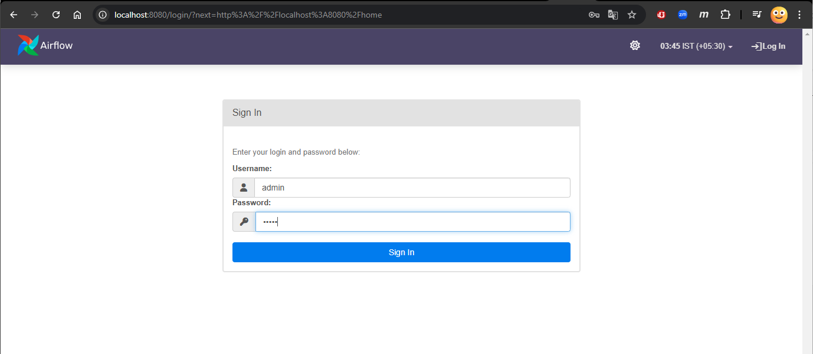
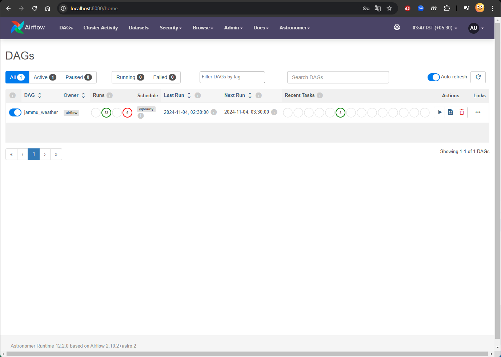
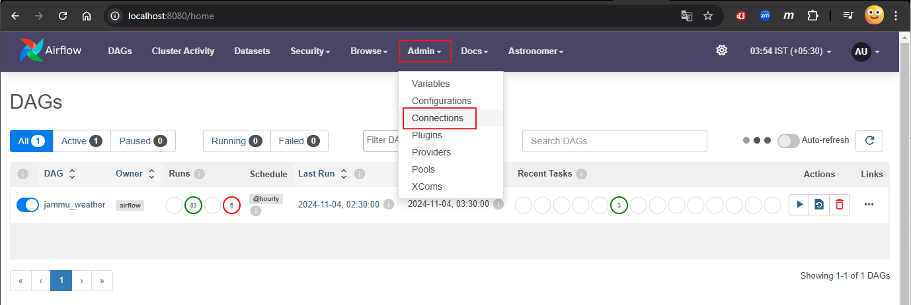
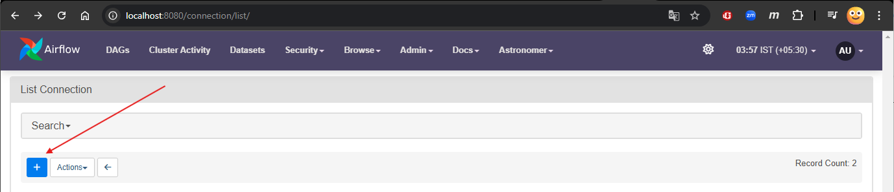
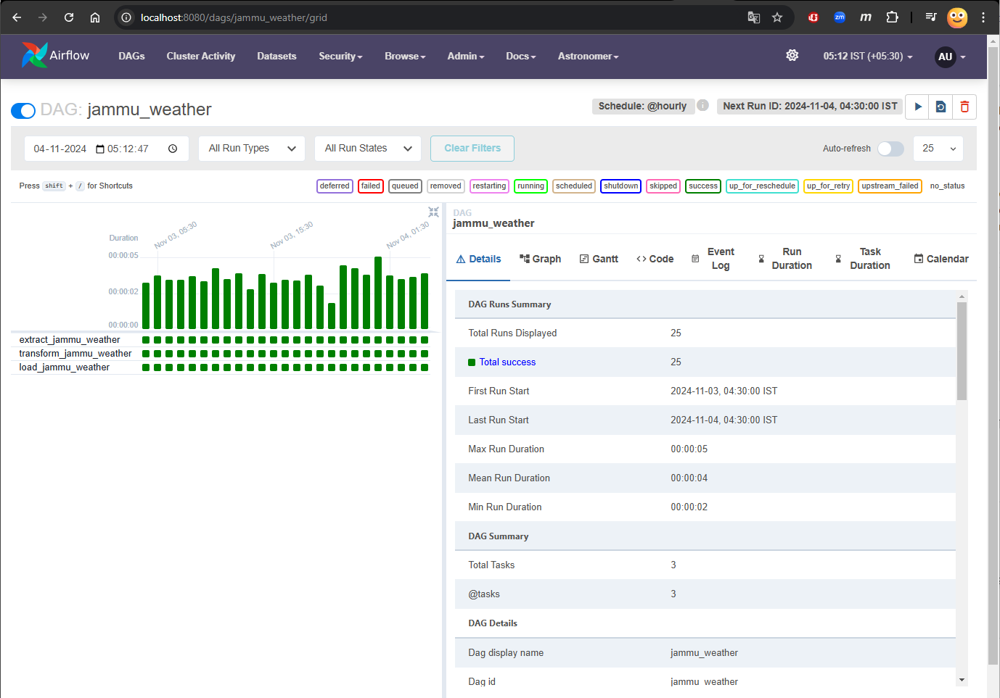

# ETL pipeline from Weather API to PostgreSQL using Apache Airflow

## Table of Contents

- [Description](#description)
- [Features](#features)
- [Installation](#installation)
- [Usage](#usage)
- [Monitoring and Troubleshooting](#monitoring-and-troubleshooting)
- [Contribution](#contribution)
- [License](#license)
- [Contact](#contact)

## Description

- This project sets up an ETL (Extract, Transform, Load) pipeline with a schedule that pulls weather data from a public Weather API and stores it in a PostgreSQL database. The pipeline is orchestrated using Apache Airflow, allowing for scheduled and reliable data processing. It uses airflow, so it is effectively a use case of batch data processing. The data is processed using a logic defined in DAG task which are orchestrated using Airflow, so that it can be used further for reporting purposes.

## Features

- **Scheduled Batch Processing:** Automatically pulls current weather data on an hourly schedule
- **Error Handling:** Logs errors and retries on failure to ensure data integrity
- **Structured Storage:**  Saves data in a well-defined schema in PostgreSQL for efficient querying
- **Scalability:** Easily extendable to enterprise-grade processing, implementing Astronomer using Airflow to incorporate more data sources/sinks

## Installation

### Prerequisites

- Ensure you have Python 3.7+ installed
- Install Docker Desktop from the [official documentation](https://docs.docker.com/engine/install/). This will help us to create a containerized environment.
- Install Astro CLI from [Astronomer's documentation](https://www.astronomer.io/docs/astro/cli/install-cli). This will help us to start Airflow locally to orchestrate data workflow.

### Steps

1. Clone the repository:

    ```bash
    git clone https://github.com/jamwalshah/airflow-etl-weather-api-to-postgres.git
    ```

2. Navigate to the project directory:

    ```bash
    cd airflow-etl-weather-api-to-postgres
    ```

3. Create the virtual environment and install the dependencies:

    - For windows:

        ```bash
        python -m venv env
        env\Scripts\activate
        pip install -r requirements.txt
        ```

    - For Linux/Mac:

        ```bash
        python3 -m venv env
        env/bin/activate
        pip3 install -r requirements.txt
        ```

## Usage

1. **Setup the environment variables**

    Create a `.env` file in the project directory using the [.env.example](./.env.example) as a reference.

    > It is *recommended* to configure the endpoint as `AWS_RDS_HOST`, the hostname of your PostgreSQL database on AWS RDS (or similar) for easier access later on. If you're using a PostgreSQL Docker container, use the container name as `POSTGRES_HOST`, the hostname instead.

2. **Run the project with Astro**

    Start the Airflow project, which will build the environment and create Docker containers for the Airflow Components (Scheduler, Web Server, Trigger and PostgreSQL)

    ```bash
    astro dev start
    ```

3. **Access the Airflow Web UI**

    Open your web browser and navigate to [https://localhost:8080/](https://localhost:8080/)

4. **Login**

    Use the default credentials
    - Username: `admin`
    - Password: `admin`
    

5. **View and Manage DAGs**

    After logging in (or click on *DAGs* tab), you can see a list of all the DAGs. You can view details of a specific DAG by clicking its name.
    

6. **Configure Connections**

    - Navigate to `Admin` > `Connections` to set up the necessary connections for your DAG
        

    - To add a connection click on `+` button
        

    - **Add an HTTP connection**
        - Use the following configuration in the form and save
  
            `Connection Id`: < Value of `API_CONN` in .env >\
            `Connection Type`: `HTTP`\
            `Host`: [`https://api.open-meteo.com/`](https://api.open-meteo.com/)

    - **Add a PostgreSQL connection**
        - Use the following configuration in the form and save

            `Connection Id`: < Value of `AWS_RDS_CONN` from .env >\
            `Connection Type`: `Postgres`\
            `Host`: < Value of `AWS_RDS_HOST` from .env >\
            `Database`: < Value of `DATABASE_NAME` from .env >\
            `Login`: < Value of DB_`USER`from .env >\
            `Password`: < Value of DB_`PASSWORD` from .env >\
            `Port`: `5432`

    > Optionally, you can also configure to dump the output into Postgres database on other services such as `Azure Database for Postgres` or a `Postgres database as docker container`

7. **Unpause and run your DAG**

    Goto `DAGs` tab at top, and unpause your DAG if not running already. Your DAG should now run on an hourly schedule.
    > You can also manually trigger the DAG by clicking the `Trigger DAG` button

8. Verify data in PostgreSQL

    Use the database tools such as DBeaver to view the contents of `weather_jammu_hourly` table in your PostgreSQL database To check the data dumped in Postgres database, you may use tools such as DBeaver to view the database contents in table `weather_jammu_hourly`

## Monitoring and Troubleshooting

To monitor the DAG (or pipeline), you can open the DAG by clicking on its name. It'll give you an interactive and detailed view of the DAG, providing you details of last runs at glance, along with further details such as Graph, Gantt Chart, code, etc. for each of the DAG runs.
  > You may open the Event logs for the failing DAG run to troubleshoot the issues, and you may select one task and then view the task specific logs for better debugging.

  

## Contribution

If you'd like to contribute to this project, please fork the repository and submit a pull request. Feel free to open issues for any bugs or feature requests!

## License

This project is licensed under the MIT License - see the [LICENSE](./LICENSE) file for the details.

## Contact

For questions or feedback, please reach out via [Linkedin @jamwalshah](https://linkedin.com/in/jamwalshah/)
